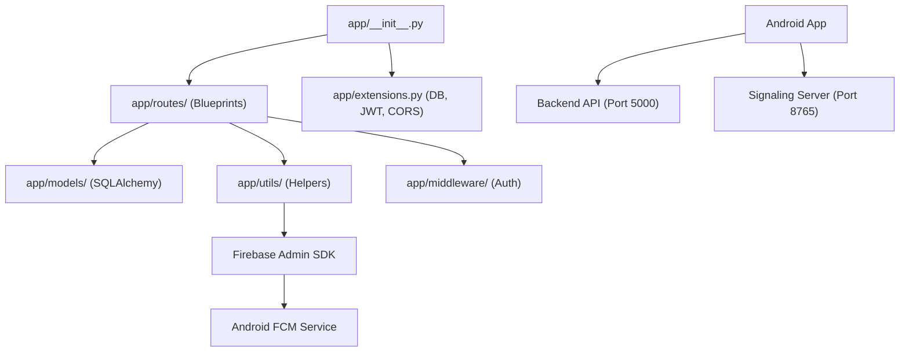

# Project Dependency Graph Summary

I have mapped the architectural dependencies between modules, routes, and services.

## 1. High-Level Dependency Graph

## 2. Route-Model Mapping
| Route Blueprint | Primary Models Used |
| :--- | :--- |
| `auth` | `User`, `Student`, `Admin`, `AdminRequest`, `OTP` |
| `radios` | `Radio`, `RadioSubscription`, `Notification`, `User` |
| `podcasts` | `Podcast`, `HandRaise`, `User` |
| `college_updates` | `CollegeUpdate`, `CollegeUpdateLike`, `CollegeUpdateView` |
| `issues` | `Issue`, `IssueMessage`, `User` |
| `placements` | `Placement`, `PlacementPoster` |
| `suggestions` | `RadioSuggestion` |
| `analytics` | `SystemEvent`, `User`, `Radio`, `CollegeUpdate` |

## 3. Firebase Dependencies
### Backend (Producer)
- **Module**: `app/utils/notifications.py`
- **Dependency**: `firebase_admin` library.
- **Trigger**: Called by `college_updates.py` whenever a new post is created.
- **Requirement**: Needs `serviceAccountKey.json` to function in production.

### Android (Consumer)
- **MainActivity**: Initializes `FirebaseMessaging` and subscribes to the `"students"` topic.
- **CampusWaveMessagingService**: Processes incoming FCM payloads to trigger local notifications and deep link navigation.

## 4. Redundant/Unused Files
Based on current usage patterns:
1. **`hms.py` & `hms_token.py`**: The project seems to have pivoted to **Agora** for live features. 100ms (HMS) files appear to be leftover from an earlier implementation.
2. **`signaling_server.py`**: This is a custom Python WebSocket server. While still referenced in Android, if you migrate fully to Agora/HMS, this standalone script becomes redundant.
3. **`app/routes/reviews.py`**: Registered in the app factory, but no corresponding UI was found in the Android project.
4. **`app/routes/comments.py`**: Similar to reviews, the Android UI has commented out or removed comment sections in several screens.
