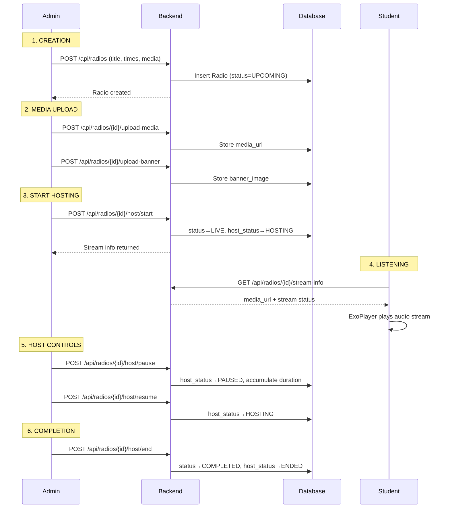
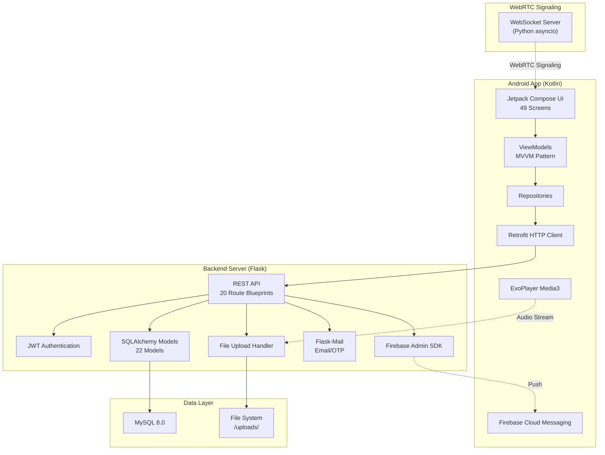

# CampusWave (Brig Radio) — Complete Application Overview

> **Date:** February 25, 2026  
> **Version:** 2.0  
> **Status:** Production Ready with Continuous Improvements

---

## 1. Overall App Purpose & Core Functionality

CampusWave (branded as **Brig Radio**) is a campus radio and content management platform connecting students and administrators through:

- **Live audio streaming** — Real-time campus radio broadcasts
- **Content management** — Posts, updates, banners, and scrolling marquee announcements
- **Student engagement** — Suggestions, issue reporting, favorites, and notifications
- **Placement hub** — Job/internship listings with bookmarking
- **Podcasts** — Scheduled and live podcast sessions with hand-raise interaction
- **Analytics** — Admin dashboards with engagement metrics and trends

The platform consists of a **Flask/Python backend API** and a **native Android app** (Kotlin/Jetpack Compose).

---

## 2. User Roles & Permissions

| Role | Description | Key Permissions |
|------|-------------|-----------------|
| **MAIN_ADMIN** | Super administrator | All admin permissions + approve/reject admin registration requests |
| **ADMIN** | Station controller | Create/manage radios, approve suggestions, manage content, view analytics, host live sessions, manage issues |
| **STUDENT** | Listener/user | Browse radios, tune in to live streams, submit suggestions, report issues, favorite content, view placements |

### Permission Boundaries

- **Admin-only endpoints** are protected by `@admin_required` decorator
- **Student-only endpoints** use `@student_required` decorator
- **Shared endpoints** use `@jwt_required()` for any authenticated user
- Admin requests flow through a **Main Admin approval process** before an admin account is activated

---

## 3. Key Modules

### 3.1 Radio Module
**Backend:** [radio.py](file:///c:/Users/Rohith%20Kumar/Campus_Wave(1)/backend/app/models/radio.py) · [radios.py](file:///c:/Users/Rohith%20Kumar/Campus_Wave(1)/backend/app/routes/radios.py)

Core module managing live and scheduled radio sessions.

| Field | Values |
|-------|--------|
| **RadioStatus** | `DRAFT`, `UPCOMING`, `LIVE`, `COMPLETED` |
| **HostStatus** | `NOT_STARTED`, `HOSTING`, `PAUSED`, `ENDED` |
| **MediaType** | `NONE`, `AUDIO`, `VIDEO` |

Key features: time-based auto-status sync, participant tracking, category assignment, media upload (banner + audio/video), favorite/subscription system, accumulated duration tracking.

---

### 3.2 College Updates (Posts)
**Backend:** [college_update.py](file:///c:/Users/Rohith%20Kumar/Campus_Wave(1)/backend/app/models/college_update.py) · [college_updates.py](file:///c:/Users/Rohith%20Kumar/Campus_Wave(1)/backend/app/routes/college_updates.py)

Instagram-like post feed supporting IMAGE and VIDEO media types, with like/view tracking and per-user `is_liked` status.

---

### 3.3 Marquee Module
**Backend:** [marquee.py](file:///c:/Users/Rohith%20Kumar/Campus_Wave(1)/backend/app/models/marquee.py) · [marquee.py](file:///c:/Users/Rohith%20Kumar/Campus_Wave(1)/backend/app/routes/marquee.py)

Scrolling text announcements with rich customization:
- **Text styling:** color, font style (Bold/Italic/Normal), font size (Small/Medium/Large)
- **Background:** solid color or gradient (start + end colors)
- **Behavior:** scroll speed (Slow/Normal/Fast), text alignment
- **Activation:** `is_active` toggle for showing/hiding

---

### 3.4 Banner Module
**Backend:** [banner.py](file:///c:/Users/Rohith%20Kumar/Campus_Wave(1)/backend/app/models/banner.py) · [banners.py](file:///c:/Users/Rohith%20Kumar/Campus_Wave(1)/backend/app/routes/banners.py)

Image carousel banners for the home screen. Admins upload images; the app displays them in an auto-sliding carousel.

---

### 3.5 Analytics Module
**Backend:** [analytics.py](file:///c:/Users/Rohith%20Kumar/Campus_Wave(1)/backend/app/routes/analytics.py)

Admin-only analytics dashboard providing:
- **System-wide analytics** — total users, radios, issues, suggestions, placements
- **Overview stats** — counts and growth metrics
- **Radio analytics** — per-radio engagement, participation, and duration
- **Trends** — weekly/monthly activity patterns

---

### 3.6 Suggestions Module
**Backend:** [radio_suggestion.py](file:///c:/Users/Rohith%20Kumar/Campus_Wave(1)/backend/app/models/radio_suggestion.py) · [suggestions.py](file:///c:/Users/Rohith%20Kumar/Campus_Wave(1)/backend/app/routes/suggestions.py)

Student-to-admin suggestion pipeline:
1. Student submits suggestion (title, description, category)
2. Status: `PENDING` → `APPROVED` or `REJECTED`
3. On approval: auto-creates a DRAFT radio session + sends notification + email to student
4. Students can view and delete their own suggestions

---

### 3.7 Issue Reports Module
**Backend:** [issue.py](file:///c:/Users/Rohith%20Kumar/Campus_Wave(1)/backend/app/models/issue.py) · [issues.py](file:///c:/Users/Rohith%20Kumar/Campus_Wave(1)/backend/app/routes/issues.py)

Campus issue tracking with threaded messaging:
- **Statuses:** `OPEN` → `IN_DISCUSSION` → `RESOLVED`
- **IssueMessage:** chat-style thread between student and admin
- Students report issues; admins respond and resolve
- Each message has sender role tracking (`admin` / `student`)

---

### 3.8 Podcasts Module
**Backend:** [podcast.py](file:///c:/Users/Rohith%20Kumar/Campus_Wave(1)/backend/app/models/podcast.py) · [podcasts.py](file:///c:/Users/Rohith%20Kumar/Campus_Wave(1)/backend/app/routes/podcasts.py)

Live podcast sessions with interactive features:
- **Statuses:** `SCHEDULED` → `LIVE` → `ENDED`
- **Hand Raise:** students can request to speak (`PENDING` → `ACCEPTED` / `IGNORED`)
- Viewer tracking, mute control, and WebRTC signaling support

---

### 3.9 Placements Module
**Backend:** [placement.py](file:///c:/Users/Rohith%20Kumar/Campus_Wave(1)/backend/app/models/placement.py) · [placements.py](file:///c:/Users/Rohith%20Kumar/Campus_Wave(1)/backend/app/routes/placements.py)

Job/internship listing system:
- **Placement:** title, company, location, salary, deadline, application link
- **PlacementPoster:** visual posters with visibility toggle
- **PlacementBookmark:** user bookmarking for saved placements

---

### 3.10 Notifications
**Backend:** [notification.py](file:///c:/Users/Rohith%20Kumar/Campus_Wave(1)/backend/app/models/notification.py) · [notifications.py](file:///c:/Users/Rohith%20Kumar/Campus_Wave(1)/backend/app/routes/notifications.py)

In-app notification system with types: `RADIO_LIVE`, `SUGGESTION_APPROVED`, `GENERAL`. Supports read/unread status, mark-all-as-read, and clear-all operations. Also integrates **Firebase Cloud Messaging (FCM)** for push notifications.

---

## 4. End-to-End Live Radio Flow



### Auto-Status Sync
The backend `sync_radio_statuses()` function runs on every radio list request, automatically transitioning radios based on current time:
- Past `end_time` with status `LIVE`/`UPCOMING` → `COMPLETED`
- Between `start_time` and `end_time` with status `UPCOMING` → `LIVE`

### Android Audio Playback
- **ExoPlayer Media3** handles foreground audio playback
- Persistent notification with play/pause/stop controls
- `AudioPlaybackService` as a foreground service for uninterrupted listening
- 5-second polling for real-time status updates

---

## 5. Content Management

| Content Type | Admin Actions | Student Actions | Storage |
|-------------|---------------|-----------------|---------|
| **Radios** | Create, edit, delete, host, upload media | Browse, tune in, favorite, subscribe | DB + `/uploads/` |
| **College Updates** | Create (image/video + caption) | View, like | DB + `/uploads/` |
| **Marquee** | Create, customize styling, activate/deactivate | View scrolling text | DB |
| **Banners** | Upload/delete images | View carousel | DB + `/uploads/` |
| **Placements** | Post listings, upload posters | Browse, bookmark | DB + `/uploads/` |
| **Suggestions** | Approve/reject | Submit, view own | DB |
| **Issues** | Respond, resolve | Report, message | DB |

### File Upload Pipeline
1. Admin uploads via multipart form
2. Backend validates file extension (`png, jpg, mp3, mp4, wav, webm, mov, avi`)
3. File saved to `backend/uploads/` directory
4. URL stored in database, served via `/uploads/<path:filename>`
5. Max file size: **200MB**

---

## 6. System Architecture Overview



### Key Technology Choices

| Layer | Technology |
|-------|-----------|
| **Backend Framework** | Flask 3.0 (Python) |
| **Database** | MySQL 8.0 + PyMySQL driver |
| **ORM** | SQLAlchemy + Flask-Migrate |
| **Auth** | JWT (Flask-JWT-Extended) + OTP email verification |
| **Android UI** | Jetpack Compose + Material Design 3 |
| **Audio** | ExoPlayer Media3 with foreground service |
| **Push Notifications** | Firebase Cloud Messaging |
| **Signaling** | WebSocket server (Python `websockets` library) |
| **HTTP Client** | Retrofit + OkHttp |
| **Image Loading** | Coil |

---

## 7. Known Limitations & Pending Issues

> [!WARNING]
> These are known issues based on recent development conversations.

| Area | Issue | Status |
|------|-------|--------|
| **Live Audio** | Audio playback has had intermittent issues with speaker output routing; multiple debugging sessions were needed | Partially resolved |
| **WebRTC/Podcast Audio** | WebRTC signaling server and podcast live audio via Agora/100ms integration have had configuration issues | Needs further testing |
| **Real-time Updates** | Currently uses HTTP polling (5s interval) instead of WebSockets for real-time data | Design limitation |
| **Offline Mode** | No offline caching or data persistence when network is unavailable | Not implemented |
| **File Uploads** | No CDN or cloud storage; files served directly from Flask server | Scalability concern |
| **SSL Configuration** | SSL is commented out for local dev; needs proper setup for production | Config needed |
| **Admin Approval** | Admin registration requires Main Admin approval — no self-service admin onboarding | By design |
| **Podcast Hand-Raise** | Full round-trip WebRTC audio for hand-raise accepted users needs end-to-end validation | In progress |

---

## 8. Completed Features vs In-Progress Features

### ✅ Completed Features

| Feature | Backend | Android |
|---------|---------|---------|
| JWT Auth + OTP verification + Password reset | ✅ | ✅ |
| User roles (Main Admin, Admin, Student) | ✅ | ✅ |
| Radio CRUD + Status management | ✅ | ✅ |
| Live radio hosting (Start/Pause/Resume/End) | ✅ | ✅ |
| Audio playback with foreground service | ✅ | ✅ |
| Auto-status sync (time-based) | ✅ | ✅ |
| College updates (posts with likes/views) | ✅ | ✅ |
| Marquee with full customization | ✅ | ✅ |
| Banner carousel management | ✅ | ✅ |
| Suggestions workflow (submit → approve/reject) | ✅ | ✅ |
| Issue reports with threaded messaging | ✅ | ✅ |
| Placement listings + posters + bookmarks | ✅ | ✅ |
| Analytics dashboard | ✅ | ✅ |
| Push notifications (FCM) | ✅ | ✅ |
| Favorites / subscriptions | ✅ | ✅ |
| Categories for radio classification | ✅ | ✅ |
| Admin invite + request approval flow | ✅ | ✅ |
| Profile management + profile picture upload | ✅ | ✅ |
| Video splash screen | — | ✅ |
| Search functionality | ✅ | ✅ |
| Station Control dashboard (refined UI) | — | ✅ |

### 🔄 In-Progress / Partial

| Feature | Status |
|---------|--------|
| Live podcast audio streaming (Agora/100ms/WebRTC) | Backend ready, audio routing debugging ongoing |
| WebRTC signaling server | Functional but needs production hardening |
| Community module (Societies) | Backend planned, partially scaffolded |
| Recording & replay of live sessions | Model fields exist (`recording_url`) but not wired end-to-end |

---

## 9. High-Level Future Improvement Suggestions

### Architecture & Performance
1. **WebSocket real-time updates** — Replace 5s polling with WebSocket/SSE for instant status changes and live data
2. **Cloud file storage** — Migrate from local `/uploads/` to AWS S3 or GCS for scalability and CDN delivery
3. **Database connection pooling** — Already configured but monitor under load; consider read replicas

### Features
4. **Offline mode** — Local caching with Room DB on Android for offline browsing
5. **Event recording & replay** — Complete the recording pipeline so students can listen to past sessions  
6. **Social features** — Comments on posts, sharing radios, user-to-user messaging
7. **Multi-language support** — i18n for Hindi and regional languages
8. **Calendar integration** — Deep link radio schedules into device calendar apps
9. **Advanced analytics** — Heatmaps, retention charts, per-student engagement scores

### DevOps & Quality
10. **CI/CD pipeline** — Automated testing, build, and deployment (GitHub Actions)
11. **API versioning** — Introduce `/api/v1/` prefix for backward compatibility
12. **Rate limiting** — Add request throttling to protect against abuse
13. **Comprehensive test suite** — Unit + integration tests for backend; UI tests for Android
14. **Error monitoring** — Integrate Sentry or similar for production crash tracking
15. **API documentation** — Auto-generate Swagger/OpenAPI docs from Flask routes

---

## 10. Android Screen Inventory (49 Screens)

````carousel
### Auth Screens (7)
- `LoginRegisterSelectionScreen` — Entry point
- `LoginScreen` / `RegisterScreen` — Credentials
- `OtpVerificationScreen` — Email OTP
- `RoleSelectionScreen` — Student/Admin choice
- `ForgotPasswordScreen` / `ResetPasswordScreen` / `NewPasswordScreen`
<!-- slide -->
### Admin Screens (16)
- `AdminDashboardScreen` — Home
- `CreateRadioScreen` / `EditRadioScreen` / `LiveHostingScreen`
- `AdminPostsScreen` / `CreateCollegeUpdateScreen`
- `ManageMarqueeScreen` — Marquee customization
- `AdminBannerScreen` — Banner management
- `AdminAnalyticsScreen` / `AnalyticsDashboardScreen` / `AnalyticsScreen`
- `RadioSuggestionsScreen` — Review suggestions
- `AdminIssuesScreen` / `AdminIssueDetailScreen`
- `InviteAdminScreen` / `AdminRequestsScreen`
- `CreatePodcastScreen` / `LivePodcastControlScreen`
- `UploadPlacementScreen`
<!-- slide -->
### Student Screens (13)
- `StudentDashboardScreen` — Home
- `CollegeUpdatesScreen` — Posts feed
- `SubmitSuggestionScreen` / `MySuggestionsScreen`
- `ReportIssueScreen` / `StudentIssuesScreen` / `StudentIssueDetailScreen`
- `FavoritesScreen` — Saved radios
- `NotificationsScreen` — Notification center
- `PlacementsScreen` — Job listings
- `CalendarScreen` — Event calendar
- `LivePodcastViewerScreen` — Listen to podcasts
- `UserDetailsScreen`
<!-- slide -->
### Common Screens (6)
- `SplashScreen` — Video splash
- `RadioDetailsScreen` — Radio detail view
- `ProfileScreen` — User profile
- `SearchScreen` — Global search
- `AboutCollegeScreen` — College info
- `HelpDeskScreen` — Help/FAQ
- `PodcastListScreen` / `PodcastComingSoonScreen`
- `WelcomeScreen` — Onboarding
````

---

> [!NOTE]
> This document was generated from direct analysis of the codebase at `c:\Users\Rohith Kumar\Campus_Wave(1)` including 22 backend models, 20 route blueprints, 49 Android screens, and the WebRTC signaling server. It is intended for internal review, documentation, and development planning.
